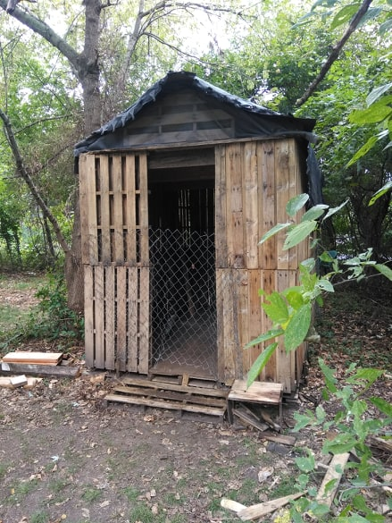

<!DOCTYPE html>
<html lang="en">
<head>
    <meta charset="UTF-8">
    <title>The Pallet Cabin</title>
    <link rel="stylesheet" href="styles.css">
</head>
<body>
<h1 id="The_pallet_cabin">
    The Pallet Cabin
</h1>
<h2 id="cabin">
    This is a cabin made out of pallets that my Dad and I have been working on its still a work
    in progress but it is just a fun project!
</h2>

</body>
</html>
